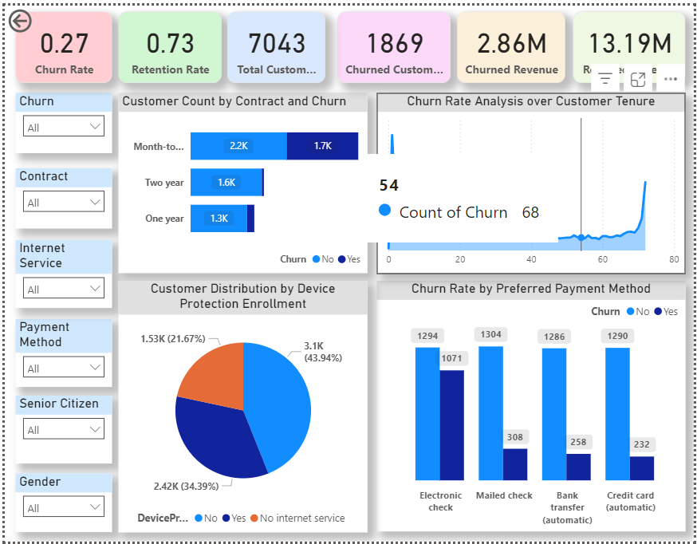

# 🔍 Telecom Customer Churn Analysis

## 📌 Project Overview

This project focuses on identifying customer churn in a telecom company using machine learning and visual analytics. It includes an **interactive Power BI dashboard** and a **Flask-based prediction web app**.

The dashboard helps business users gain insights into churn patterns, while the web app allows real-time churn prediction based on customer usage data.

---

## 🧰 Tools & Technologies Used

- **Power BI** – for data visualization and interactive dashboards  
- **Python (Flask)** – for building the web application  
- **Scikit-learn** – for machine learning modeling  
- **Pandas & NumPy** – for data manipulation  
- **Pickle** – to save and load pre-trained models  
- **HTML/CSS** – for the web interface  

---

## 📷 Dashboard Preview

### Dashboard 1  


### Dashboard 2  


---

## 🔽 Files Included

- `telecom_churn_analysis.pbix` – Power BI dashboard file  
- `app.py` – Flask web application for churn prediction  
- `models/` – Folder containing serialized models:
  - `random_forest_model.pkl`
  - `label_encoder.pkl`
  - `standard_scaler.pkl`
- `templates/index.html` – HTML form for input and prediction display  
- `dashboard1.png`, `dashboard2.png` – Dashboard preview images  

---

## 🔍 Key Insights from Dashboard

- **Churn Rate** analysis across different segments and plans  
- **Impact of Customer Service Calls** on churn  
- **Usage Patterns**: Day, Evening, Night, International call usage  
- **Customer Profile Analysis** based on plan subscriptions  

---

## 🚀 How to Run the App Locally

1. Clone the repository  
   ```bash
   git clone https://github.com/your-username/telecom-churn-analysis.git
   cd telecom-churn-analysis
## 📊 Business Impact
This project enables telecom companies to:

Predict which customers are likely to churn

Understand key drivers behind churn behavior

Visualize KPIs and customer trends for better decision-making

## 🎯 Outcome
✅ Demonstrates ML model deployment using Flask

✅ Builds professional, interactive dashboards with Power BI

✅ Enables data-driven decision-making in customer retention strategies

